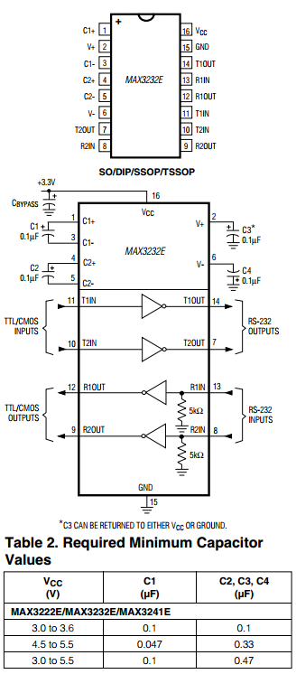
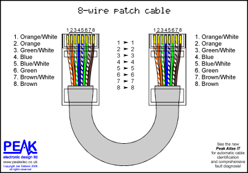
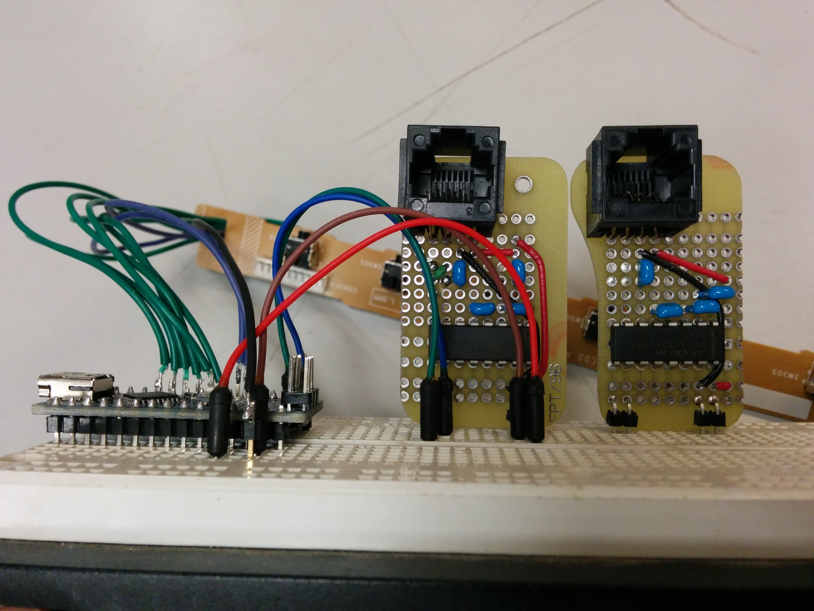
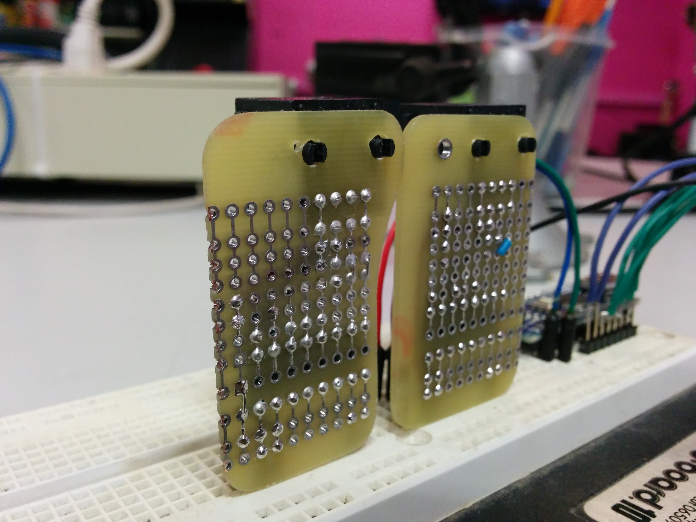
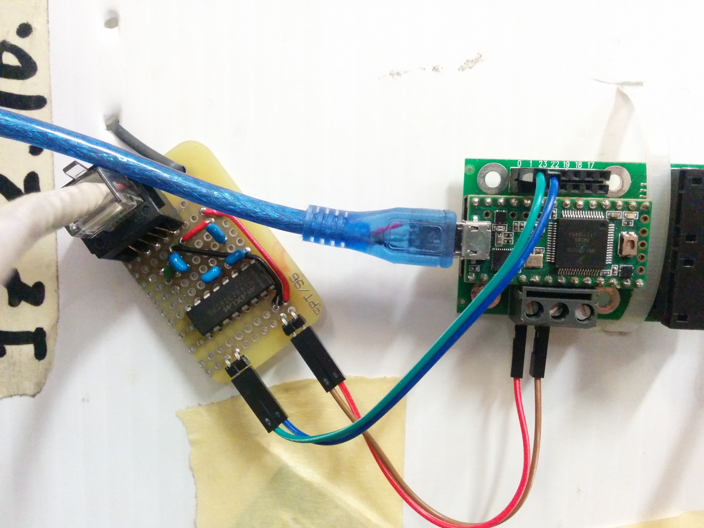
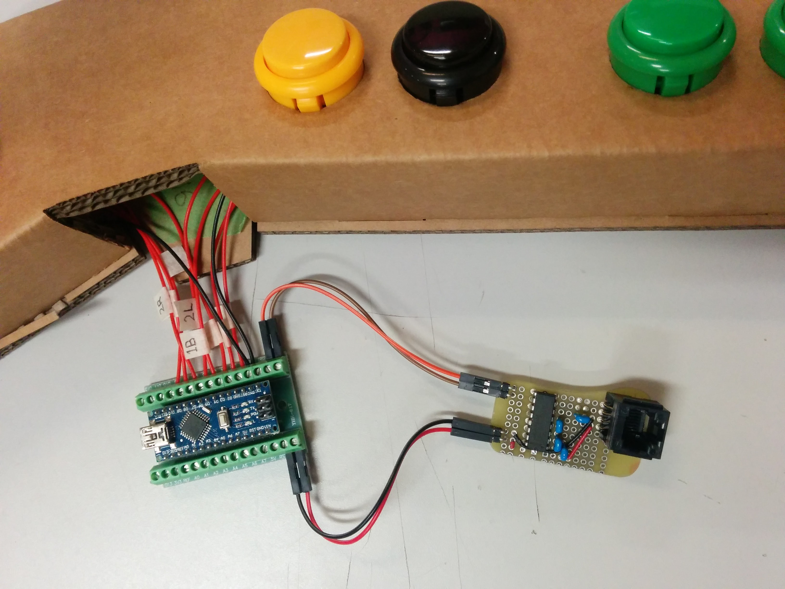

The bulk of the game runs on a [Teensy 3.1](https://www.pjrc.com/teensy/teensy31.html) connected to the LED wall via the [OctoWS2811 shield](https://www.pjrc.com/store/octo28_adaptor.html). The user controls are connected to another Arduino, which communicates button state with the Teensy over UART Serial.

I needed the button controller to be at least 5m away from the Teensy and the LED wall, so that the controller could be positioned at the front of a booth, with the LED wall hanging at the back. Since 5V serial communication doesn't transfer reliably over such distances, I used a MAX232-compatible chip to convert the TTL (5V) serial logic to RS-232 (15V) levels.

[Datasheet for MAX3232ECPE](http://datasheets.maximintegrated.com/en/ds/MAX3222E-MAX3246E.pdf). Any MAX232-compatible chip should also work. These are the applicable diagrams from the datasheet:

Cabling used is standard Cat-6 Ethernet cable. 8 wires isn't necessary, but Cat-6 is convenient and easy to come by. We used a 20' ethernet cable without issue.

##TTL Serial to RS-232 over Cat-6 Adapter

I made these RS-232 adapter boards with Cat-6 (ethernet) sockets, to transfer both the serial data and 5V power to the controller Arduino. They are electrically identical, except for on one I have crossed the Tx and Rx lines on the RS-232 side because it's designed for a straight-through ethernet cable. The male angle headers are (in order) 5V, Gnd, Tx, Rx.

This is how the RS-232 adapter connects to the Teensy's OctoWS2811 Shield.

This is how the RS-232 adapter and Arduino Nano (with screw terminal breakout) connects to the button controller. The Nano is powered by the Teensy through the ethernet cable.

